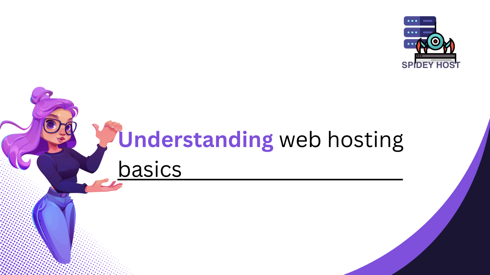

When starting a website, understanding web hosting is key. This guide simplifies what web hosting is, how it works, and the types available, helping you make informed choices for your online presence.
<!--more-->
## 1. What is Web Hosting?

Web hosting is a service that allows you to publish your website or web application on the internet. When you create a website, all of its content—such as text, images, videos, and code—needs to be stored somewhere so that it can be accessed by users online. This is where web hosting comes in.

A web hosting provider stores your website’s files on their servers, which are powerful computers designed to run and manage websites. When someone types your website's address (URL) into their browser, their computer connects to the server where your website is hosted, and the server delivers your site’s content to them.

## 2. How Does Web Hosting Work?

The process of web hosting involves several key components:

- **Servers:** These are powerful computers that store your website's files and data. Servers are designed to handle multiple requests simultaneously, ensuring your website is accessible to users around the world.
  
- **Domains:** A domain is your website's address on the internet (e.g., www.yourwebsite.com). When a user types your domain into their browser, it directs them to your website hosted on a specific server.
  
- **Bandwidth:** This refers to the amount of data that can be transferred between your website and its users over a certain period. Higher bandwidth allows for faster loading times, especially for websites with large files or high traffic volumes.

- **Storage:** This is the amount of space available on the server to store your website's files. Depending on your hosting plan, storage can range from a few gigabytes to unlimited capacity.

## 3. Types of Web Hosting

There are several types of web hosting available, each with its own advantages and disadvantages depending on your needs:

### a. Shared Hosting

**Best For:** Small websites, blogs, and beginners

Shared hosting is the most basic and affordable type of web hosting. In shared hosting, multiple websites share the same server resources, such as CPU, RAM, and storage. This keeps costs low but can affect performance if other sites on the server consume too many resources.

**Pros:**
- Cost-effective
- Easy to set up and manage
- No technical expertise required

**Cons:**
- Limited resources
- Slower performance during high-traffic periods
- Less control over server settings

### b. VPS Hosting (Virtual Private Server)

**Best For:** Growing websites, developers, and businesses

VPS hosting provides more resources and control by creating virtual servers within a physical server. Each VPS operates independently, offering better performance and customization options than shared hosting.

**Pros:**
- More control and customization
- Better performance and reliability
- Scalable resources

**Cons:**
- More expensive than shared hosting
- Requires some technical knowledge

### c. Dedicated Hosting

**Best For:** Large websites, high-traffic sites, and businesses

Dedicated hosting gives you an entire server dedicated solely to your website. This provides maximum performance, security, and control, making it ideal for websites with high traffic or specific security requirements.

**Pros:**
- Full control over the server
- Excellent performance and reliability
- High level of security

**Cons:**
- Expensive
- Requires advanced technical expertise

### d. Cloud Hosting

**Best For:** Websites with variable traffic and scalability needs

Cloud hosting uses a network of interconnected servers to host your website. This allows for easy scalability, as resources can be adjusted based on traffic demand. It's a great option for websites that experience traffic spikes or need high availability.

**Pros:**
- Scalable resources
- High reliability and uptime
- Pay-as-you-go pricing

**Cons:**
- Can be more expensive than traditional hosting
- May require technical knowledge to manage

### e. Managed Hosting

**Best For:** WordPress users and non-technical users

Managed hosting is a service where the hosting provider takes care of all the technical aspects of running the server, including security, updates, and backups. This type of hosting is often optimized for specific platforms like WordPress.

**Pros:**
- Hassle-free management
- Optimized for performance and security
- Regular backups and updates

**Cons:**
- Higher cost than unmanaged hosting
- Less flexibility for custom configurations

## 4. Key Features to Consider

When choosing a web hosting plan, consider these key features to ensure it meets your website's needs:

- **Uptime:** Look for a hosting provider with a high uptime guarantee (99.9% or higher) to ensure your website is always accessible.
- **Speed:** Fast loading times are essential for a good user experience and SEO. Choose a hosting plan that offers sufficient bandwidth and performance optimizations.
- **Security:** Ensure your hosting provider offers robust security features, such as SSL certificates, firewalls, and regular backups, to protect your website from threats.
- **Support:** Reliable customer support is crucial, especially if you're new to web hosting. Look for 24/7 support with multiple contact options.
- **Scalability:** Choose a hosting plan that can grow with your website. If you expect your site to expand, ensure your hosting provider offers easy upgrades.

## Conclusion

Understanding web hosting basics is essential to making informed decisions about your website. Whether you're just starting or looking to switch providers, knowing how web hosting works and the different types available will help you choose the best option for your needs. By selecting the right hosting plan, you can ensure your website runs smoothly, securely, and efficiently, providing a great experience for your visitors.

Happy hosting!
