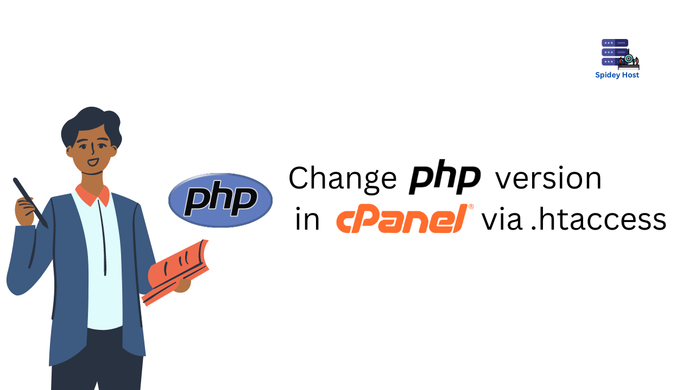

Changing the PHP version for your website can be necessary for compatibility with different scripts or for leveraging new features. In this guide, we'll show you how to change the PHP version using the `.htaccess` file in cPanel.

<!--more-->



## Step 1: Access Your cPanel

Log in to your cPanel account. If you're unsure how to do this, look for the cPanel login link in the welcome email from your hosting provider.

## Step 2: Open the File Manager

1. Navigate to the **File Manager** under the **Files** section.
2. In the File Manager, go to the **public_html** directory or the directory where your website files are located.

## Step 3: Locate or Create the .htaccess File

1. Look for the `.htaccess` file in your site's root directory. If it doesn't exist, you can create one by clicking on **+ File** at the top left corner.
2. Name the file `.htaccess` and make sure it's created in the correct directory.

## Step 4: Edit the .htaccess File

1. Right-click on the `.htaccess` file and select **Edit**.
2. Add the following line at the top of the file to change the PHP version:

```plaintext
AddHandler application/x-httpd-php74 .php
```
Replace 74 with your desired PHP version, such as 80 for PHP 8.0.

## Step 5: Save the Changes
After making the changes, click on Save Changes in the top right corner.

## Step 6: Verify the PHP Version
To confirm that the PHP version has changed, you can create a phpinfo.php file in the same directory:

- In the File Manager, click on + File and name it `phpinfo.php`.
- Add the following code:  

```php
<?php
phpinfo();
?>
```
- Save the file and access it via your browser (e.g., yourdomain.com/phpinfo.php). The page should display the current PHP version.

## Conclusion
Changing the PHP version via `.htaccess` is a quick way to ensure your site runs on the desired PHP version without altering the server's global settings. This method is particularly useful for shared hosting environments.
