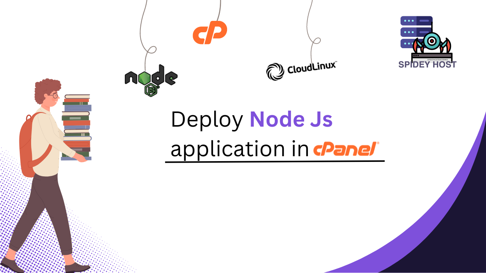
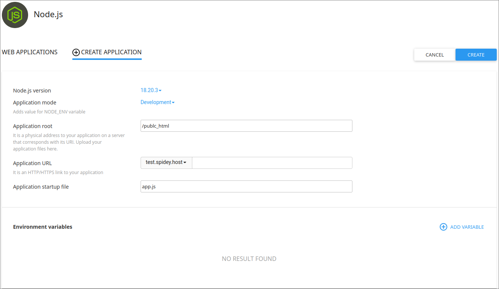
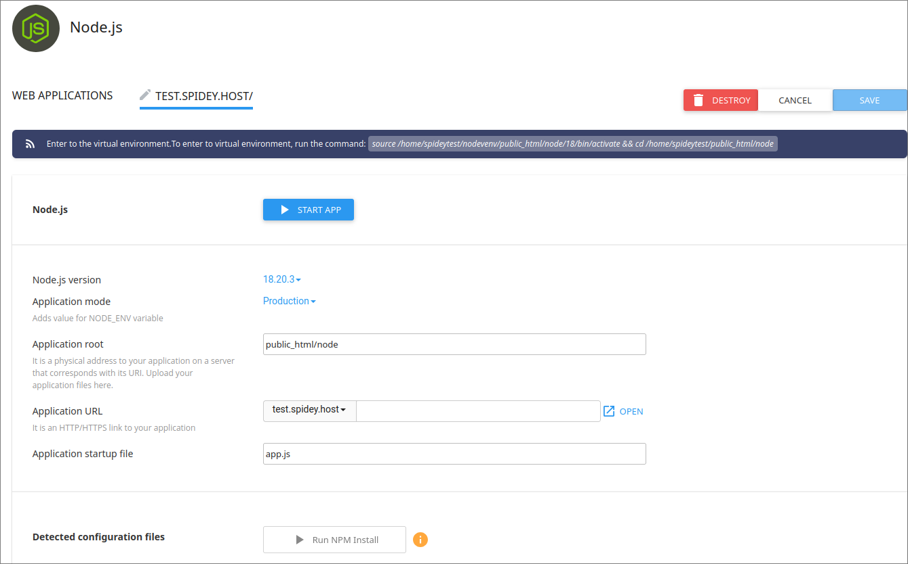

---
title : How to Deploy a Node.js Application in cPanel 
date : 2024-08-15 14:00:00 +0000
author: Spideyhost
cover : cover.png
categories :
    - Web Hosting
    - cPanel
    - Node.js
tags :
    - cPanel
    - Node.js
    - Deployment
---  

Step-by-step guide to deploying a Node.js application in cPanel.
<!--more-->

## Prerequisites

- A cPanel hosting account with Node.js support
- Access to cPanel
- A Node.js application ready for deployment

## Step 1: Log in to cPanel

Log in to your cPanel account using your credentials. You can typically access cPanel by visiting `yourdomain.com/cpanel`.

## Step 2: Access the Node.js Application Setup

1. In the cPanel dashboard, scroll down to the **Software** section.
2. Click on **Setup Node.js App**.

## Step 3: Create a New Application

1. Click on the **Create Application** button.
2. Configure the application settings:
   - **Node.js Version**: Select the version of Node.js required by your application.
   - **Application Mode**: Choose **Production** if you’re deploying a live application.
   - **Application Root**: Specify the directory where your application is located. (e.g., `/home/username/app`)
   - **Application URL**: Define the URL where your application will be accessible. This is typically your domain or a subdomain.
   - **Application Startup File**: Specify the entry point of your application (e.g., `app.js` or `index.js`).

3. Click **Create** to set up the application.

## Step 4: Upload Your Application Files

1. Navigate to the **File Manager** in cPanel.
2. Go to the directory you specified as the **Application Root**.
3. Upload your Node.js application files to this directory.
   - You can use the **Upload** feature in File Manager or an FTP client for this step.

## Step 5: Install Dependencies

1. Go back to the **Setup Node.js App** section.
2. Under the **Actions** column of your application, click **Run NPM Install**. This will install all dependencies listed in your `package.json` file.

## Step 6: Start the Application

1. After the dependencies are installed, go to the **Setup Node.js App** section again.
2. Under **Actions**, click **Start Application**. Your Node.js application will now be running on your server.

## Step 7: Test Your Application

Visit the **Application URL** you configured earlier to test if your Node.js application is running correctly.

## Conclusion

Deploying a Node.js application in cPanel is a simple process with the right steps. By following this guide, your Node.js app should be up and running in no time. If you encounter any issues, ensure that your application settings and file paths are correctly configured.

