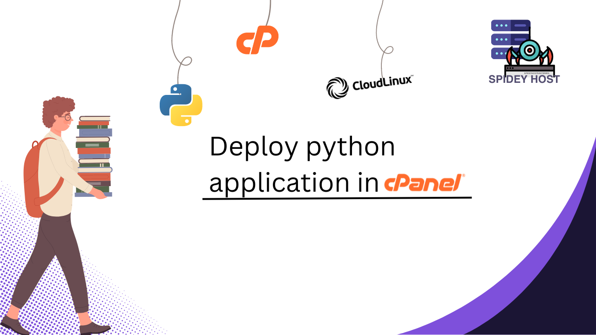

Learn how to deploy a Python application step-by-step, from setting up your environment to going live.

<!--more-->
Deploying a Python application on cPanel is a convenient option, especially if your web hosting provider offers cPanel as part of their services. This guide will walk you through the process from start to finish, helping you get your Python app live with minimal hassle.

## 1. Preparing Your Python Application

Before you start the deployment process, ensure that your Python application is ready for deployment:

- **Virtual Environment:** It’s recommended to develop your application in a virtual environment to avoid conflicts.

  ```bash
  python3 -m venv venv
  source venv/bin/activate
  ```  
- **Dependencies:**  Make sure all your project dependencies are listed in a requirements.txt file.
    ```bash
    pip freeze > requirements.txt
    ```
## 2. Accessing cPanel
1. **Login to cPanel**: Access your cPanel account by logging in with your credentials. This is typically done through yourdomain.com/cpanel or via a link provided by your hosting provider.

2. **Locate the Python Setup**: In cPanel, find the "Setup Python App" icon under the "Software" section.

## 3. Setting Up Your Python Application
1. **Create a New Python Application**:

- Click on "Setup Python App".
- Select the desired Python version from the dropdown menu.
- Choose the directory where your application resides or create a new directory within your home directory.
- Click "Create".

2. **Install Dependencies**:

-  Once the application is created, you’ll see options to manage it.

- Click on "Enter to the virtual environment" to access your app’s virtual environment.

- Install your dependencies using the command provided or via the terminal:
    ```bash
    source /home/username/virtualenv/your_app/3.8/bin/activate
    pip install -r /home/username/your_app/requirements.txt
    ```
3. **Configure the Application**:
- Set the application startup file (e.g., app.py) and the entry point (e.g., app:app for Flask or project.wsgi:application for Django).
- Adjust the environment variables if necessary.
4. **Create a Passenger WSGI File (For Flask/Django Apps)**:

- If you're deploying a Flask or Django app, create a passenger_wsgi.py file in your app’s root directory:
```python 
import sys
sys.path.insert(0, '/home/username/your_app')

from app import app as application  # For Flask
# or
from project.wsgi import application  # For Django
```
## 4. Deploying and Testing Your Application
1. **Access Your App**:

- Once everything is set up, you can access your application through the URL provided by cPanel, which usually follows the format https://yourdomain.com/python_app.

2. **Troubleshooting**:

- If your application does not work as expected, check the error logs in cPanel to identify and fix any issues.
## 5. Managing Your Application

- **Restarting the Application**:
    - If you make changes to your code, you may need to restart your application. This can be done through the "Setup Python App" section by clicking on "Restart" next to your app.

- **Updating Dependencies**:
    - To update or add new dependencies, activate your virtual environment and run pip install as needed.
## Conclusion

Deploying a Python application on cPanel is a streamlined process that can be done with a few clicks. Whether you're hosting a simple Flask app or a more complex Django project, cPanel provides the tools you need to manage your deployment with ease. For reliable and powerful hosting services, consider using [Spidey Host](https://spidey.host) to ensure your Python apps run smoothly.

