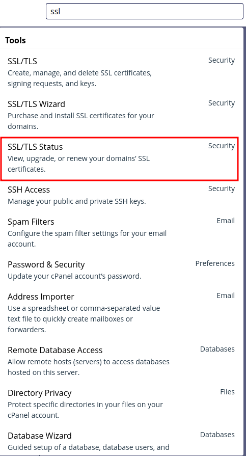
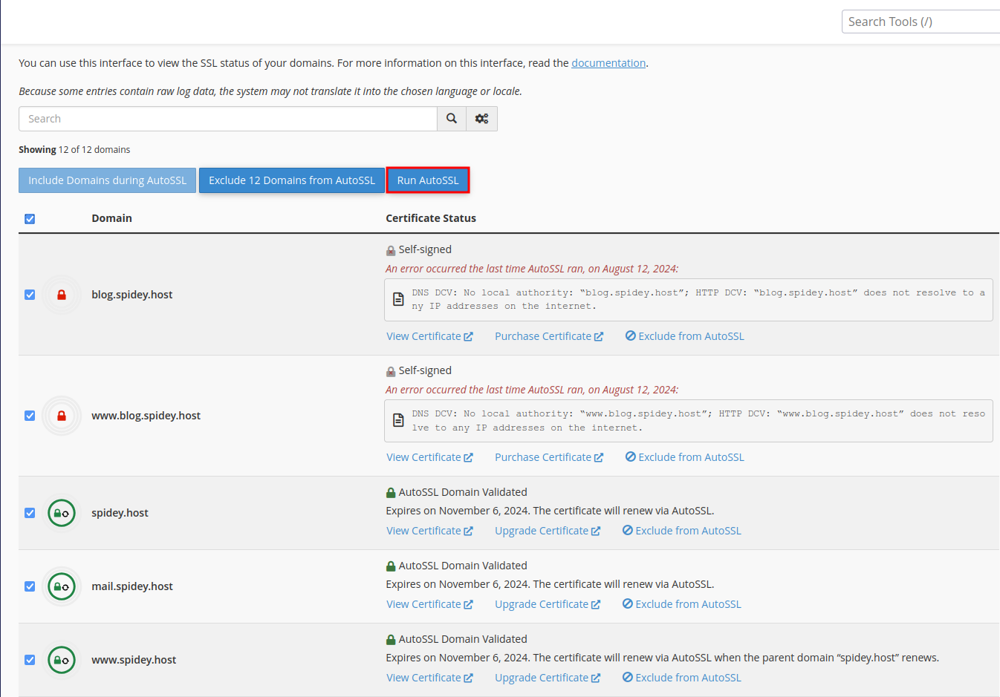

Securing your website with an SSL certificate is crucial to protect sensitive data and build trust with your visitors. If you're using cPanel, installing an SSL certificate is a straightforward process. Follow the steps below to install an SSL certificate on your domain.

<!--more-->

## Step 1: Log in to cPanel

The first step is to log in to your cPanel account. You can usually access cPanel by navigating to `yourdomain.com/cpanel` and entering your login credentials.

## Step 2: Search for SSL/TLS Status

Once logged in, use the search bar at the top of the cPanel dashboard. Type "SSL/TLS" and click on the "SSL/TLS Status" option that appears. This section allows you to manage SSL certificates for your domains.

## Step 3: Select the Domain

In the SSL/TLS Status section, you'll see a list of your domains. Select the domain for which you want to install the SSL certificate by checking the box next to it.

## Step 4: Run AutoSSL

After selecting the domain, click the "Run AutoSSL" button at the top of the page. cPanel will now attempt to install a free SSL certificate for the selected domain automatically.

## Important Note

Before running AutoSSL, make sure your domain is properly pointed to the server. If your domain isn't pointing correctly, the AutoSSL process may fail, and the SSL certificate won't be installed.

---

Following these steps will ensure that your domain is secured with an SSL certificate. An SSL-secured website not only protects your visitors' data but also improves your website's ranking in search engines.

