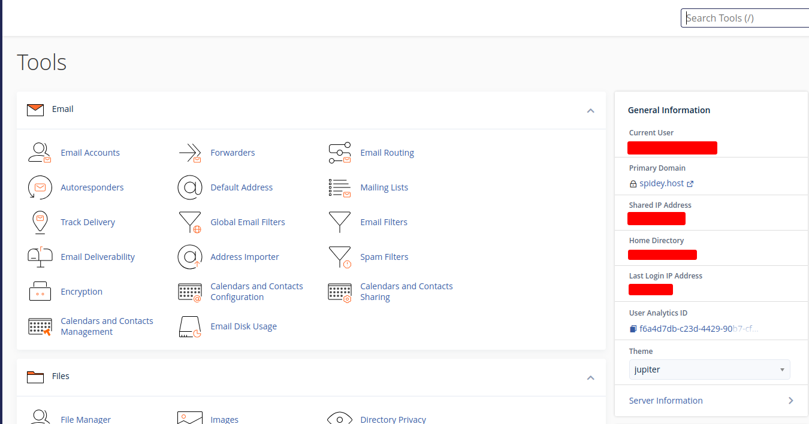
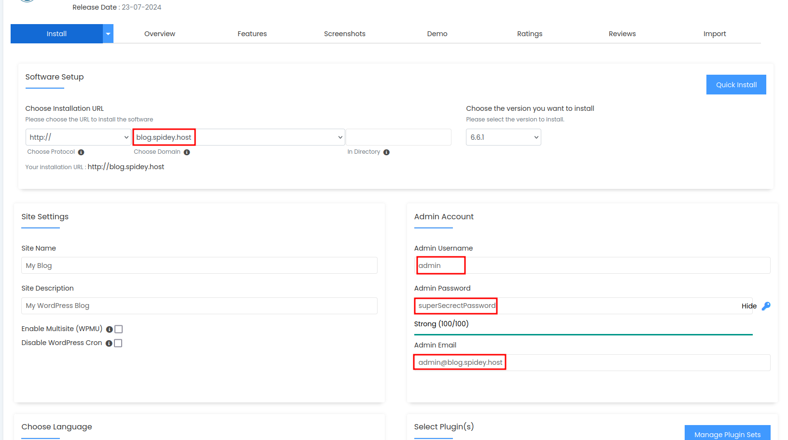
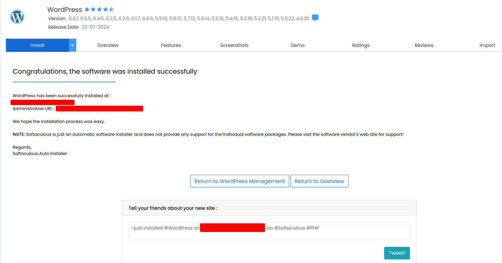

cPanel is a popular control panel for managing web hosting. This guide will walk you through the process of installing WordPress via cPanel.  

<!--more-->

## Prerequisites   
Before you start, make sure you have cPanel web hosting package.  
[Get hosting packge](https://spidey.host/shared-hosting) at 20% discount use code **```SPIDEYNEW20```** from [spidey.host](https://spidey.host/shared-hosting)

## Installation Guide

### Access Your cPanel account
Begin by logging into your cPanel account


### Step 2: Locate and Open the WordPress Installer
Once logged in, scroll to the **Software** section and click on WordPress under **Site Software** or **Softaculous Apps Installer**, based on your hosting provider.


### Step 3: Start the Installation
On the WordPress installer page, click the **Install Now** button.

### Step 4: Configure the WordPress Installation
Provide the necessary details for your WordPress setup:

- **Choose Protocol**: Pick ```http://``` or ```https://``` based on your SSL certificate.
- **Choose Domain**: Select the domain where you want to set up WordPress.
- **In Directory**: Leave this field empty to install WordPress in the root directory or specify a folder name for installation in a subdirectory.

#### Site Settings

- **Site Name**: Enter the name of your site.
- **Site Description**: Provide a brief description of your site.

#### Admin Account

- **Admin Username**: Choose a username for the WordPress admin account.
- **Admin Password**: Set a strong password.
- **Admin Email**: Input your email address.

#### Database Settings

- **Database Name**: You can use the default name or create a new one.
- **Table Prefix**: Keep the default ```wp_``` or change it for added security.  



### Step 5: Finalize the Installation

Once you've entered all the details, scroll down and click the **Install** button. The installation process will take a few minutes.
Step 6: Access Your New WordPress Site

After the installation is complete, you'll see a success message with the URL of your new WordPress site and the admin URL. Click the links to visit your site and log in to the WordPress admin dashboard.



## Conclusion

Congratulations! You’ve successfully set up WordPress using cPanel. You can now begin customizing your site and adding content. If you run into any issues, consult the documentation provided by your hosting provider or seek help on the WordPress support forums.